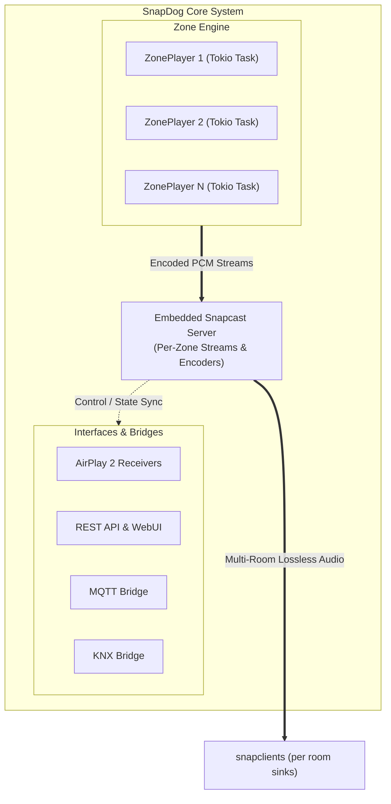

import { Card, CardGrid } from '@astrojs/starlight/components';

**SnapDog** is a premium, open-source multi-room synchronized audio controller that runs as a single binary on Linux and macOS. It embeds a completely rewritten [Snapcast](https://github.com/badaix/snapcast) compatible server in pure Rust, runs AirPlay and Spotify Connect receivers per zone, streams from Subsonic/Navidrome media servers, plays internet radio, and bridges everything tightly to MQTT and KNX.

---

## Core Architecture

SnapDog is built with standard Rust async concurrency using `tokio` and structured logging using `tracing`.

### The ZonePlayer
Each audio zone is run by a dedicated, independent `ZonePlayer` task. The player owns the entire audio pipeline:
* **Decoding:** Reads streams from Subsonic, Internet Radio, or arbitrary URLs using `symphonia` (pure Rust decoder).
* **AirPlay 2 / Spotify Connect:** Dedicated background receivers preempt any active decode pipeline and stream directly to the zone.
* **DSP Processing:** Applies parametric EQ (N-band biquads) and Spinorama speaker correction profiles to the raw float PCM stream.
* **Snapcast Writer:** Encodes the resampled PCM stream into FLAC or F32LZ4 and writes it to the Snapcast server stream source.

---

## Key Features

<CardGrid>
  <Card title="Embedded Snapcast Server" icon="rocket">
    Reimplemented in pure Rust via `snapcast-rs`. Supports lossless sync playback across multiple rooms.
  </Card>
  <Card title="Built-in DSP & EQ" icon="setting">
    Per-zone parametric equalizer and Spinorama speaker correction profile database (over 1,000+ speakers).
  </Card>
  <Card title="Smart Home Bridges" icon="random">
    Zero-config Home Assistant integration via MQTT and programmable KNX client/device modules.
  </Card>
  <Card title="SnapDog OS" icon="laptop">
    A custom, minimal Buildroot Linux image that turns any Raspberry Pi into a dedicated high-fidelity receiver.
  </Card>
</CardGrid>

---

## Next Steps

Explore the following guides to set up, configure, and control your SnapDog multi-room system:

<CardGrid>
  <Card title="Installation Guide" icon="right-arrow">
    Deploy the SnapDog daemon via Docker, native packages, or compile from source. Read the [Installation Guide](/docs/installation).
  </Card>
  <Card title="Configuration Reference" icon="right-arrow">
    Configure zones, client speakers, and smart home bridges in `snapdog.toml`. Read the [Configuration Guide](/docs/configuration).
  </Card>
  <Card title="SnapDog OS" icon="right-arrow">
    Turn a Raspberry Pi into a dedicated, zero-config high-fidelity audio receiver. Read the [SnapDog OS Guide](/docs/snapdog-os).
  </Card>
  <Card title="Developer Reference" icon="right-arrow">
    Integrate client applications via REST, WebSockets, D-Bus, or the binary protocol. Read the [REST API Reference](/docs/api-rest).
  </Card>
</CardGrid>
